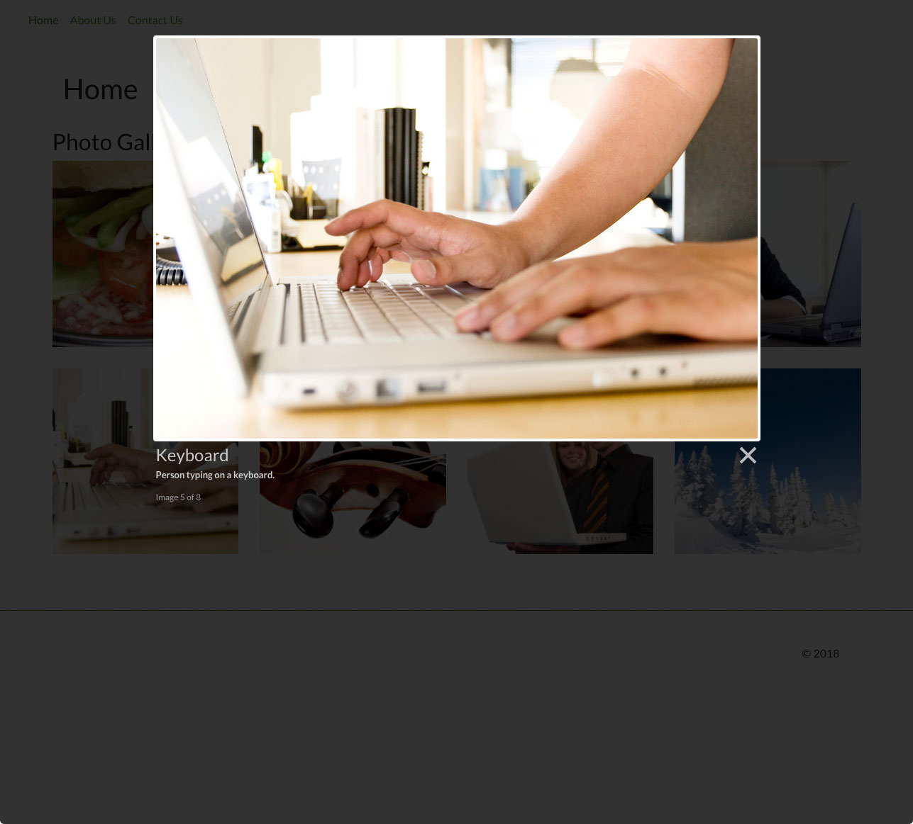

# Silverstripe Elemental Gallery

## Requirements

* silverstripe/recipe-cms: ^4@dev
* dnadesign/silverstripe-elemental: ^4@dev

## Installation

`composer require dynamic/silverstripe-elemental-gallery`

## Example usage

Photo Gallery Element block allows you to display a collection of images. Click on the image thumbnail to open a larger version in Lightbox.

## Screen Shots

#### Front End sample of a Gallery Element

#### Front End sample of a Gallery Element - Lightbox

#### CMS - Gallery Main Tab

#### CMS - Gallery - Add/Edit Gallery Image

## Getting more elements

See [Elemental modules by Dynamic](https://github.com/dynamic/silverstripe-elemental-blocks#getting-more-elements)

## Configuration

See [SilverStripe Elemental Configuration](https://github.com/dnadesign/silverstripe-elemental#configuration)

